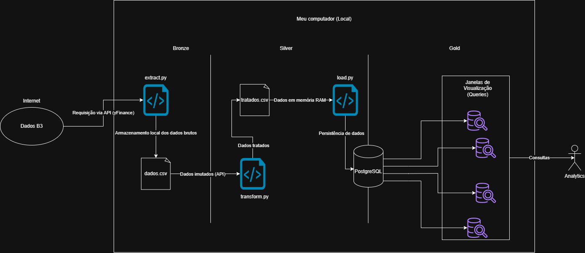

# 📈 Pipeline ETL de Dados Financeiros da B3 (Ações & FIIs)


## 📖 Sobre o Projeto

Este projeto consiste na construção de um pipeline ETL (Extração, Transformação e Carga) para automação e estruturação de dados históricos de ativos da B3 (Ações e Fundos Imobiliários), utilizando dados públicos obtidos via biblioteca `yfinance` (Yahoo Finance).

O objetivo principal é simular o fluxo de engenharia de uma instituição financeira: capturar os dados diários de ativos selecionados (como PETR4, VALE3, HGLG11 e MXRF11), centralizar o histórico de forma segura e organizá-lo em uma arquitetura de camadas (**Raw, Silver e Gold**). Isso garante a qualidade, padronização e governança dos dados antes de sua disponibilização para consumo de analistas de negócio ou ferramentas de BI.

## 🎯 Problema de Negócio

Instituições financeiras e mesas de operações dependem de dados analíticos rápidos e confiáveis para tomar decisões de investimento. Consumir dados diretamente de APIs externas em tempo de execução gera gargalos de performance, custos desnecessários e riscos de inconsistência (dados nulos ou formatos incorretos).

Este pipeline resolve esse problema ao automatizar a ingestão e o saneamento dos dados de mercado. Ele preserva o histórico imutável na camada de entrada e materializa tabelas pré-agregadas no banco de dados, prontas para uso analítico com máxima performance e zero retrabalho de limpeza por parte dos analistas.

## 🛠️ Stack Utilizada

| Camada         | Tecnologia / Ferramenta |
| -------------- | ----------------------- |
| Fonte de Dados | API Yahoo Finance (`yfinance`) |
| Linguagem      | Python 3.10+            |
| Transformação  | Pandas                  |
| Armazenamento  | Sistema de Arquivos Local (CSV) e Banco Relacional (PostgreSQL) |
| Carga/Conexão  | SQLAlchemy / Psycopg2   |
| Versionamento  | Git e GitHub            |

## 🏗️ Decisões de Arquitetura e Fluxo dos Dados

O pipeline segue o padrão de mercado para organização de Data Lakes e Data Warehouses, a **Arquitetura Medalhão**:

<p align=\"center">
        
</p>

### 📂 Raw (Bronze)
Armazena os dados históricos em formato `.parquet` exatamente como foram retornados pela API, garantindo a imutabilidade e a possibilidade de reprocessamento em caso de falhas catastróficas.

### 📂 Silver (Trusted)
Camada onde o Python entra em ação com Pandas para aplicar as regras de saneamento: remoção de linhas nulas, tipagem correta de valores financeiros e padronização dos nomes das colunas para o padrão do banco (*snake_case*).

### 📂 Gold (Refined)
Os dados tratados são persistidos em um banco de dados relacional. Utilizando **SQL**, os dados são modelados e materializados em tabelas agregadas de performance (ex: valorização acumulada de 15 dias), otimizando o consumo de ferramentas de BI e Analytics.

## 📂 Estrutura do Projeto

```text
b3-market-data-pipeline/
│
├── assets/                     # Imagens e recursos adicionais da documentação
│   └── pipeline-b3-v1.drawio.png
│
├── data/                       # Camada de Armazenamento Local (Ignorada no Git)
│   └── raw/                    # Arquivos CSV brutos extraídos do yfinance
│
├── sql/                        # Scripts de modelagem de dados
│   └── gold_queries.sql        # Queries de criação e materialização da Camada Gold
│
├── src/                        # Scripts modulares em Python (Código Fonte)
│   ├── extraction/
│   │   ├── README.md
│   │   └── extract.py          # Script de ingestão da API para a pasta Raw
│   ├── transformation/
│   │   ├── README.md
│   │   └── transform.py        # Script de limpeza e transformação com Pandas
│   └── loading/         
│       ├── README.md
│       └── load.py             # Script de conexão e carga para o Banco de Dados
│
├── main.py                     # Script orquestrador principal do pipeline
├── requirements.txt            # Dependências do projeto
├── README.md                   # Documentação
└── .gitignore                  # Filtro de arquivos para o Git
```

## ⚙️ Como Executar
**Pré-requisitos**
- Python 3.10 ou superior instalado.
- Banco de dados PostgreSQL configurado (ou utilização do SQLite nativo).

**Passo a Passo**
1. Clone o repositório:
```bash
git clone https://github.com/luc4sh3nriqu3/b3-market-data-pipeline.git
cd b3-market-data-pipeline
```
2. Crie o ambiente virtual:
```bash
python -m venv .venv
# No Windows:
.\.venv\Scripts\activate
# No Linux/Mac:
source .venv/bin/activate
```
3. Instale as dependências:
```bash
pip install -r requirements.txt
```
4. Execute o pipeline:
```bash
python main.py
```

## 📌 Funcionalidades da V1.0

- Extração automatizada de histórico de preços de Ações e FIIs da B3.
- Salvamento imutável de arquivos na camada Raw (Data Lake local).
- Pipeline de higienização com Pandas (tratamento de nulos e renomeação técnica).
- Carga automatizada via SQLAlchemy em banco relacional.
- Scripts SQL para criação de tabelas gerenciais na camada Gold.


## 🚀 Próximas Melhorias (Roadmap)
- V2.0: Migrar a camada Raw e Silver para a nuvem utilizando buckets AWS S3 ou Azure Blob Storage.

- V2.1: Implementar modelagem dimensional (Star Schema) na camada de banco de dados.

- V3.0: Substituir a execução manual pela orquestração de fluxos com Apache Airflow ou Prefect rodando em containers Docker.

## 👩‍💻 Autor
**Lucas Henrique Amorim da Silva**
- Estudante de Ciência da Computação
- Foco de estudos em Engenharia de Dados e Arquitetura de Big Data


## 📄 Licença
Este projeto foi desenvolvido estritamente para fins educacionais e composição de portfólio de Engenharia de Dados.